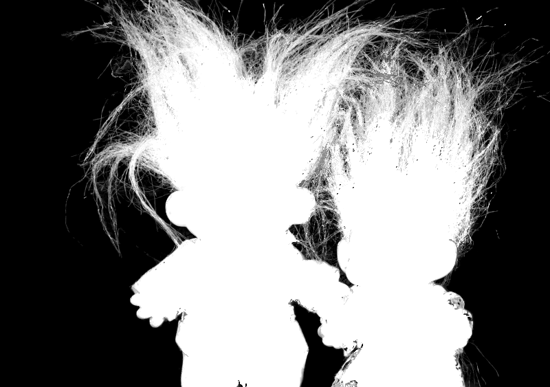
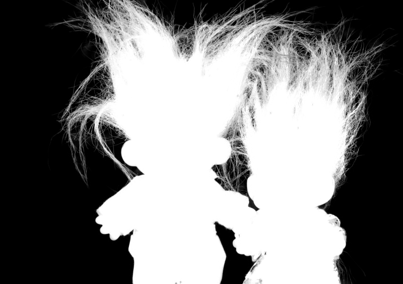
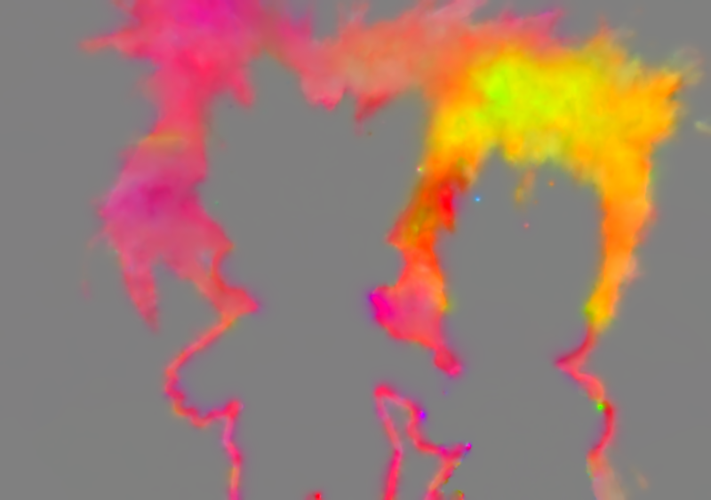
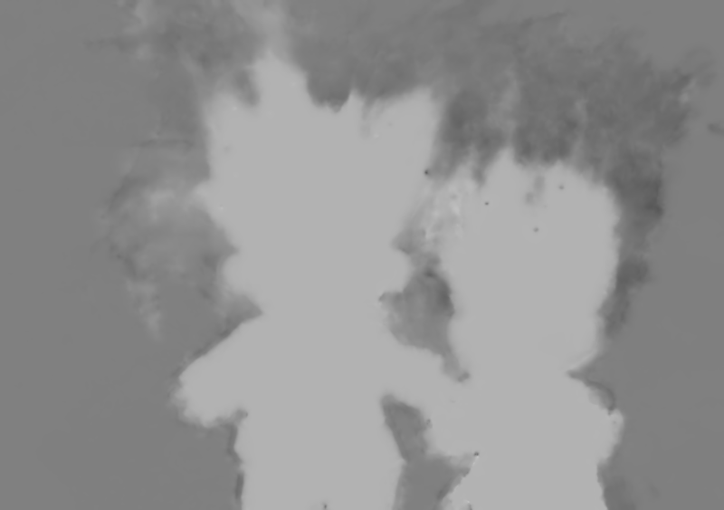

# An Alternative Matting Laplacian

This package contains two scripts to run colour grading as described in

```
[Pitie16] An Alternative Matting Laplacian. F. Pitie, (2016)
          In International Conference on Image Processing (ICIP'16), September.
```

Please cite our publication when using the code.

Send an email to fpitie@mee.tcd.ie if you want more information

## Example

Run the demo
```
>>> demo
```

<table style="width:100%">
<tr>
<td></td>
<td></td>
</tr>
<tr>
<td>input image</td>
<td>input alpha estimate (using sampling)</td>
</tr>
<tr>
<td></td>
<td></td>
</tr>
<tr>
<td>estimated alpha (rescale)</td>
<td></td>
</tr>
<tr>
<td></td>
<td></td>
</tr>
<tr>
<td>estimated a (rescale)</td>
<td>estimated b (rescale)</td>
</tr>
</table>

##References

```
[1] A. Levin, D. Lischinski, and Y. Weiss, “A closed-form solution to natural image matting,”
Pattern Analysis and Machine Intelligence, IEEE Transactions on, vol. 30, no. 2, pp. 228–242, Feb 2008.
```


